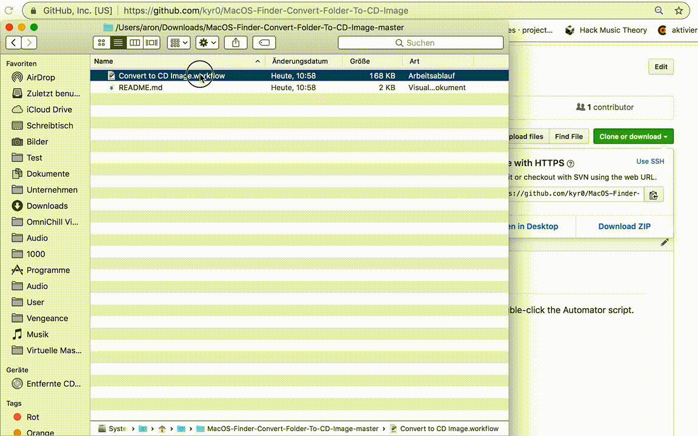

## MacOS/Finder context menu entry: Convert to CD image

Transforms arbitrary folders into ISO 9660 joliet ISO images.
Simply download and double-click the Automator script.

Then `Finder -> Select arbitrary folder -> Convert to CD image`
    
    
    
### How to install?

1. Click on the green button "Clone or Download" -> "Download ZIP".
2. Extract the ZIP and double-click: "Convert to CD image".
3. Click "Install" (prompts if system service should be installed)

### How to use?

1. Open Finder
2. Select an arbitrary folder
3. Right-click -> "Convert to CD image"

Use the .iso file of the file/folder created as ISO 9660 joliet image.

### How does it work?

The whole process is using the Automator capabilities of Mac OS.
Automator is a scripting subsystem available since OS X 10.4 (Tiger).
It is set up as a "Service" which takes a selected folder in  
Finder as an argument. The services registers the Finder context menu entry "Convert to CD image".

The command executed (in bash) is:

    handle_error() {
        osascript -e 'tell app "System Events" to display dialog "Select a single directory (not a file) and make sure the output ISO file does not exist already."'
    }
    
    trap 'handle_error $LINENO' ERR
    
    for f in "$@"
        do
                 hdiutil makehybrid -o "$f.iso" "$f" -iso -joliet 2>> /dev/null     
        done
    
    exit 0
   
#### Motivation

Helping PCem, an emulator to run on MacOS brought up the issue how
to transfer files/folders from the host to the guest OS. This works
using CD ROM image mounts but the process wasn't quite elegant and
involved complex terminal interactions. This solution feels better.